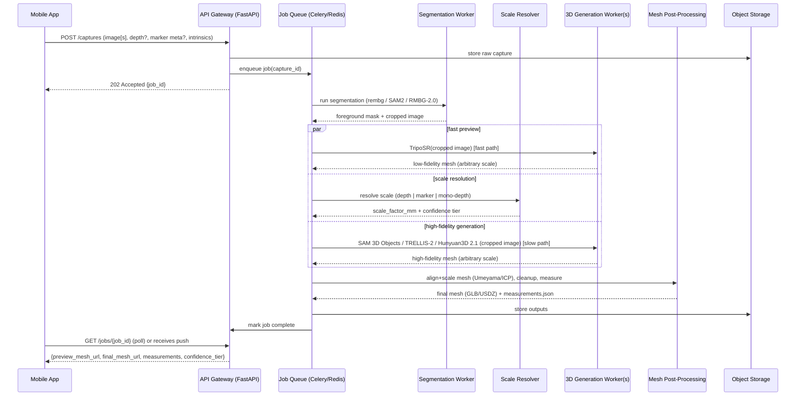

# System Architecture

## 1. High-level components

```
┌─────────────────────────────┐        ┌───────────────────────────────────────────────┐        ┌──────────────────┐
│         MOBILE APP          │        │              BACKEND (self-hosted)             │        │   OBJECT STORAGE   │
│  iOS (Swift) / Android(Kt)  │  HTTPS │   API GW → Queue → GPU Workers → Postgres      │  S3    │  MinIO / S3-compat  │
│  Capture · Preview · AR view│◄──────►│                                                 │◄──────►│  images / meshes    │
└─────────────────────────────┘        └───────────────────────────────────────────────┘        └──────────────────┘
```

The system is a classic **thin client + async GPU backend** — the phone captures data and renders results; all heavy ML inference happens server-side on GPU workers we operate ourselves.

## 2. Mobile app component responsibilities

| Component | Responsibility |
|---|---|
| **Capture flow / UI** | Guides the user through the correct capture mode (see §3) depending on detected device capability; live framing/quality feedback (blur detection, distance-to-subject, lighting). |
| **Sensor capture layer** | iOS: `ARKit` (`ARSession`, `ARFrame.sceneDepth` on LiDAR devices), `AVFoundation` for plain camera. Android: `ARCore` (`Session`, `Frame.acquireDepthImage16Bits()`), `CameraX` for plain camera. |
| **Marker overlay (Tier 2 capture)** | Renders an on-screen ArUco marker guide / or lets the user print one; live-detects the marker via on-device OpenCV to confirm it's visible and well-framed before upload. |
| **Upload client** | Compresses/packages RGB frame(s) + optional depth map + camera intrinsics + marker metadata; multipart upload to the backend; resumable for spotty connections. |
| **Job status client** | Polls `GET /jobs/{id}` or subscribes via WebSocket/push for the two-stage result (fast preview → refined final asset). |
| **3D/AR viewer** | iOS: `RealityKit`/`ARKit Quick Look` (native USDZ support, drag-and-drop AR placement for free). Android: `Filament` or a WebView-hosted `<model-viewer>` (Google's web component, GLB/GLTF, also supports AR via Scene Viewer handoff). |
| **Measurement overlay UI** | Renders bounding-box dimension lines / labels on the 3D view; shows the accuracy tier badge (see `docs/04-measurement-methodology.md` §5) so the user knows how much to trust the numbers. |
| **On-device lightweight inference (optional, nice-to-have)** | A small segmentation/quality model (e.g., MobileSAM or a distilled U²-Net) run via **Core ML** (iOS) or **TensorFlow Lite / ONNX Runtime Mobile** (Android) purely for real-time capture guidance — *not* for the final mesh, which always happens server-side. |

## 3. Capture mode decision tree (client-side)

```mermaid
flowchart TD
    Start[App opens capture screen] --> Check{Device has LiDAR (iOS)\nor ARCore Depth API support?}
    Check -->|Yes| T1[TIER 1 FLOW\nGuided multi-frame capture\n1-3s phone motion\ncaptures RGB + metric depth]
    Check -->|No| Ask[Prompt: "Add a reference card\nfor accurate measurements?"]
    Ask -->|User adds marker/card| T2[TIER 2 FLOW\nSingle photo with marker\nin frame, same plane as object]
    Ask -->|User skips| T3[TIER 3 FLOW\nSingle photo, no reference\nEstimated measurements only]
    T1 --> Upload[Upload to backend]
    T2 --> Upload
    T3 --> Upload
```

The UX default should **nudge users toward Tier 1 or Tier 2** whenever possible (it's a small amount of extra friction for a large accuracy gain) but never block Tier 3 — a rough estimate is still useful and is the graceful fallback on older/non-LiDAR devices.

## 4. Backend pipeline (sequence)



## 5. Backend service breakdown

| Service | Tech | Notes |
|---|---|---|
| **API Gateway** | FastAPI (Python) or Node/Express | Auth, request validation, enqueues jobs, serves job status, signs S3 URLs. |
| **Job Queue** | Celery + Redis (or RQ for something lighter) | GPU work is slow/bursty — never do it in the request/response cycle. |
| **Segmentation Worker(s)** | PyTorch service running rembg / SAM2 / SAM3 / RMBG-2.0 | Can run on CPU (rembg) or shared GPU pool depending on model chosen. |
| **Scale Resolver** | Pure Python/OpenCV service (no GPU needed unless running a monocular metric-depth net) | Branches on capture tier: point-cloud back-projection (depth), ArUco homography (marker), or a metric-depth model inference (Metric3D v2 / UniDepth v2) for Tier 3. |
| **3D Generation Worker(s)** | PyTorch services hosting SAM 3D Objects / TRELLIS-2 / Hunyuan3D 2.1 / TripoSR | These are the GPU-hungry, expensive-to-scale nodes; isolate them behind the queue so they can autoscale independently (see §6). |
| **Mesh Post-Processing Worker** | Open3D + trimesh + PyMeshLab | Alignment, decimation, hole-filling, measurement extraction, format export. |
| **Object Storage** | MinIO (self-hosted S3-compatible) or AWS S3 | Raw captures + generated assets. |
| **Metadata DB** | PostgreSQL | Users, jobs, capture metadata, measurement results, model/version used (important for reproducibility/debugging quality regressions). |
| **Auth** | Standard JWT/OAuth2, or a managed auth provider | Out of scope of the 3D pipeline itself but needed before any real deployment. |

## 6. GPU sizing & deployment notes

- **TripoSR** (fast preview): fits comfortably on a single mid-range GPU (<8GB), very cheap to run per-request — could even run several concurrently on one card.
- **SAM 3D Objects / TRELLIS-2**: budget **24GB VRAM** class GPUs (e.g., RTX 4090, L4, A10G) per concurrent job.
- **Hunyuan3D 2.1** full pipeline (shape+texture): budget **~29GB**, or split shape (10GB) and texture (21GB) stages onto separate worker pools sized independently — texture generation is the heavier, more parallelizable stage, shape generation is on the request's critical path.
- Containerize each generation model in its own Docker image (`nvidia-container-toolkit`) — these repos have finicky, sometimes conflicting CUDA/Python dependency requirements (custom-compiled rasterizer/renderer extensions in Hunyuan3D, `spconv`/`xformers`/`nvdiffrast` in TRELLIS-2), so isolation avoids dependency hell.
- Start with a **single GPU box running docker-compose** for MVP/dev; move to **Kubernetes with GPU node pools + a queue-depth-based autoscaler** (e.g., KEDA watching Redis/Celery queue length) once there's real traffic. Don't build the Kubernetes layer on day one — it's premature for an MVP.
- Cache/reuse loaded model weights across requests within a worker process (don't reload the model from disk per job) — this is the single biggest latency lever after GPU choice.

## 7. Privacy & data-handling notes (worth deciding early, not bolted on later)

- Captured photos may include private spaces/people incidentally in frame — define a retention policy (e.g., auto-delete raw captures N days after the mesh is generated, keep only the final asset if the user saves it).
- Encrypt objects at rest in S3/MinIO; encrypt in transit (TLS everywhere, including gateway → GPU workers if they're not on a private network).
- If SAM3-based text-prompted segmentation or SAM 3D Body (human reconstruction) is used, review Meta's usage terms for any restrictions around biometric/human-subject data before shipping a feature that reconstructs people.
