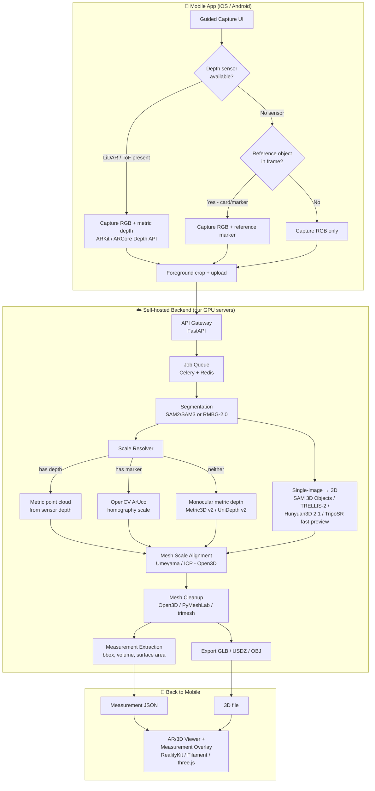

# Photo → 3D Model + Measurements — Implementation Plan

A mobile app that takes a photo (or short guided capture) and produces a **textured 3D model** plus **real-world measurements** (L × W × H, volume, etc.), built entirely on **self-hosted, open-source models**. No third-party "image-to-3D" API (Meshy, Tripo, Rodin, Luma, Kaedim, CSM, Meshcapade, etc.) is used anywhere in this plan — every model in the pipeline is a downloadable open-weight model that we run on our own infrastructure or on-device.

This repo folder contains the full plan, split into focused documents:

| File | What's in it |
|---|---|
| `README.md` (this file) | Executive summary, architecture diagram, key decisions, quick-start reading order |
| `docs/01-research-notes.md` | Raw research: what exists today, model comparisons, licenses, benchmarks, reference links |
| `docs/02-architecture.md` | Detailed system architecture, sequence diagrams, component responsibilities |
| `docs/03-tech-stack.md` | Concrete tools/libraries per layer (mobile, backend, ML, infra) with alternatives |
| `docs/04-measurement-methodology.md` | The hard part — how we actually get *real-world* measurements out of a photo, with the math |
| `docs/05-roadmap.md` | Phased build plan, milestones, effort estimate, risks |

Read them in that order if you're new to the plan. If you just want the TL;DR, keep reading.

> **Already built:** the MVP core of this plan — upload a photo, get a scaled 3D model plus
> its measurements — is implemented in `app/` and runs as a single Gradio app inside a free
> Colab T4 notebook. See **[SETUP.md](SETUP.md)** to run it. The queue, database, object
> store and mobile clients described below are deliberately not part of that MVP.

---

## 1. The core problem, honestly stated

There are two separate problems hiding inside "generate a 3D model with measurements from a photo," and they need two different kinds of technology:

1. **Shape/geometry/texture generation** — turning a 2D image into a plausible 3D mesh. This is a solved-enough problem today using open-source **generative single-image-to-3D models** (2025–2026 generation: Meta SAM 3D Objects, Microsoft TRELLIS-2, Tencent Hunyuan3D 2.1, TripoSR). They're genuinely good.
2. **Absolute scale/measurement** — knowing that the mesh they output is, say, "38 cm tall" rather than an arbitrary unit-scale blob. **This is the part almost every consumer "photo to 3D" app quietly fudges or ignores**, and it's the part this plan treats as a first-class problem rather than an afterthought.

A single 2D photo, on its own, is **fundamentally scale-ambiguous** — a toy car photographed close up and a real car photographed far away can produce identical pixels. No AI model can losslessly undo that ambiguity from pixels alone; it can only guess using learned priors about typical object sizes (and those guesses can be off by a lot for atypical objects). So this plan is built around **three tiers of measurement accuracy**, from "engineering-grade" to "rough estimate," and is explicit with the user about which one they're getting. Full details and math are in `docs/04-measurement-methodology.md`.

## 2. Architecture at a glance

## 3. Key architectural decisions (and why)

| Decision | Why |
|---|---|
| **Self-hosted open-source models only, no image-to-3D SaaS API** | Explicit requirement; also gives full control over data privacy, cost at scale, and no vendor lock-in/rate limits. |
| **Two-speed generation: fast low-fidelity preview + queued high-fidelity job** | TripoSR produces a rough mesh in under a second on a GPU; the good models (TRELLIS-2, Hunyuan3D 2.1, SAM 3D Objects) take several seconds to tens of seconds. Show the user something instantly, then swap in the refined asset. |
| **Segmentation before generation** | All the generative 3D models work best on a clean, background-removed subject. This is also where we crop out the reference marker before it confuses the 3D generator. |
| **Scale is computed independently of mesh generation, then applied to the mesh afterward** | The generative models output meshes in an arbitrary canonical scale — they were never trained to output metric units. Trying to get "metric-scale mesh generation" out of them directly is not realistic; instead we compute real-world scale separately (via depth sensor, marker, or monocular metric-depth model) and rigidly scale the generated mesh to match. |
| **Native mobile development (Swift/ARKit, Kotlin/ARCore) rather than pure cross-platform** | Depth sensor access (LiDAR raw depth, ARCore Depth API, camera intrinsics) is deepest and most reliable through the native AR frameworks. A cross-platform shell (Flutter/RN) with native plugins is a viable alternative — see `docs/03-tech-stack.md`. |
| **Job queue + polling/websocket, not synchronous request** | GPU 3D generation is not sub-200ms; treat it like a background job from day one. |

## 4. What "existing models" we're standing on

Short version (full comparison table with links/licenses/VRAM in `docs/01-research-notes.md`):

- **Image → 3D mesh generation:** Meta **SAM 3D Objects** (Nov 2025, open weights, best real-world/in-the-wild generalization from one photo), Microsoft **TRELLIS-2** (MIT license, best raw open-source quality, needs ~24GB VRAM), Tencent **Hunyuan3D 2.1** (permissive commercial license w/ attribution, strong PBR textures), **TripoSR** (MIT, sub-second, low VRAM, used as the fast preview).
- **Foreground segmentation / background removal:** **SAM2/SAM3** (Meta) or lighter **RMBG-2.0 / BiRefNet / rembg (U²-Net)** for a cheaper CPU-friendly option.
- **Monocular metric depth (scale without a sensor):** **Metric3D v2**, **UniDepth v2**, **Depth Pro**, **MoGe-2** — all open weight, all predict absolute (metric) depth from one RGB image, with varying accuracy.
- **Classical CV for marker-based scale:** OpenCV's **ArUco** module — decades-old, extremely reliable, near-zero cost.
- **Mesh processing:** **Open3D**, **trimesh**, **PyMeshLab** for cleanup, alignment, and measurement extraction.

None of these are called through a hosted "3D generation" product API — they're all weights we download once and run ourselves.

## 5. Where to go next

- Skeptical about the measurement accuracy claims? Start with `docs/04-measurement-methodology.md`.
- Want the model comparison and every reference link? `docs/01-research-notes.md`.
- Want to just start building? `docs/05-roadmap.md` has the phased plan starting with a backend-only MVP.
